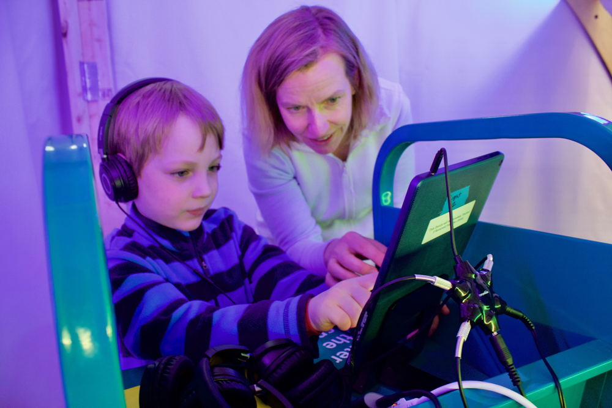

#Alterspace

Alterspace is a new kind of reading room: a simple set of controls lets patrons decide on the color and behavior of lights and sounds in the space, adapting conditions for brainstorming, meditation, or quiet study. 


Photo by Hannah Schoenbaum

More information about the project is available here: https://alterspace.github.io/

This project is a collaboration between Harvard's [Library Innovation Lab](https://lil.law.harvard.edu) and [metaLAB](https://metalab.github.io).

## Instructions
This project was tested on python 3.5


### Install
```
$ pip install pyenv
$ pyenv install 3.5.4 
$ pyenv virtualenv 3.5.4 alterspace
$ pyenv activate alterspace
```

```
$ cp config/config.example.py config/config.py
$ pip install -r requirements.txt
$ cd frontend && npm install

```

### Run

```
$ fab run
```
or, to run on a different port:
```
$ fab run:8000
```
In development, we need to serve both the flask app and vue frontend.  

### Vue/Static assets
To serve files:
```
$ fab npm 
```
This command cds into the /frontend dir and runs `npm run build`, which causes the javascript to be loaded live from http://127.0.0.1:8080/ and recompiled on save.


Remember to build files before adding them to the source code:
```
$ fab build
```
Now you should be able to visit http://127.0.0.1:5000/ and see everything working as intended.

Note: some static assets live in the /public folder. On build, these get copied over to the /dist folder
instead of compiled using the webpack configuration.

### Styles
Most styles live in SCSS format in alter-space/frontend/src/assets/css
Some small overrides can live in a <style scoped> fashion in the .vue files


### Working with SVGs
We use the lovely [vue-svgicon](https://github.com/MMF-FE/vue-svgicon#use-generated-icon) for dealing with svgs in Vue.
To use, place all svg assets into frontend/svg-icons.
Run the following command to compile (assets will be placed in frontend/components/icons):
```
$ cd ./frontend
$ npm run generate-icons
```

In your Vue component's script tag, import your icon

```python
  import './icons/your-icon';
```

In your vue component's template, place the svg
```html
<svgicon icon="your-icon" width="60" height="60" :original="true" class="btn-default" stroke="0"></svgicon>
```

### Setting your lights IDs
Since you might use this app in several locations with different light setups, you can key in your specific light IDs by visiting a URL (a more permanent solution to follow).
Simply go to http://localhost:8080/#/light/your-light-id to set the light id.
Check http://localhost:8080/#/light to verify that the correct ID has been set.